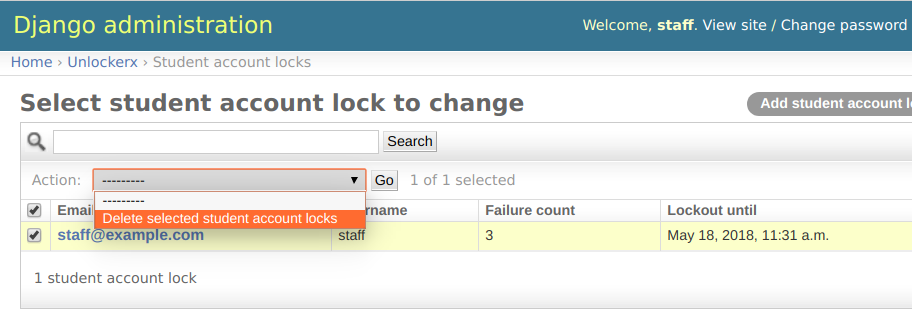

UnlockerX
=========

|travis-badge| |codecov-badge| |doc-badge|

An app to manage (and remove) both student-specific and IP-based locks in the Open edX platform.

Overview
--------
The edX Platform has two types of security rate limits to avoid
stealing user passwords using brute-force attacks:

- **IP-based rate limits:** Using `django-ratelimit-backend <https://github.com/brutasse/django-ratelimit-backend>`_
  to rate-limit subsequent incorrect requests and block the requester IP address for a period of time. IP-based locks
  are stored on the cache backend.
- **Student-account locks:** This an *optional* edX platform feature. It works on the login screen and locks
  user-accounts (regardless of the IP address) for a period of time. Student-locks are stored on the ``LoginFailure``
  model (in the database).

UnlockerX stores the IP-based rate limits in the database once a lock occurs in ``RateLimitedIP`` model. Additionally
UnlockerX exposes both of ``LoginFailure`` and ``RateLimitedIP`` in an admin interface in which a superuser can
remove the locks and rate-limits, which is handy to support learners quickly.

How to Install
--------------
- Install the pip package ``$ pip install -e git+git@github.com:appsembler/unlockerX.git#egg=unlockerx``
- Add ``unlockerx`` to ``ADDL_INSTALLED_APPS`` in the ``lms.env.json`` file (or in ``server-vars.yml``).
- Since the student-specific locks are disabled by default, enable it via
  ``FEATURES['ENABLE_MAX_FAILED_LOGIN_ATTEMPTS'] = True``. More on `account lockout from edX <https://github.com/edx/edx-platform/wiki/Optional-Account-lockout-after-excessive-login-failures>`_.
- Migrate and run the server.

How to Use
----------
- Go to ``/admin/unlockerx/``
- Pick either one of ``RateLimitedIP`` or ``StudentAccountLock``
- Select a limit (using the checkbox)
- Click on the action dropdown and remove the limit.
  |admin-screenshot|
- Make the learner happy!

Monkey Patching
---------------
This module monkey-patches the edX platform in two ways:

- Changes the ``RateLimitMixin.requests`` to 100 to be a bit more permissive for mass-students logging in from
  a shared university IP.
- Adds the UnlockerX rate-limit middleware to ``MIDDLEWARE_CLASSES`` to log blocked requests to the database.

License
-------

The code in this repository is licensed under the MIT License unless
otherwise noted.

Please see ``LICENSE.txt`` for details.

The original code was developed at `Edraak <https://github.com/Edraak/edraak-platform/pull/43>`_ and used to be
licensed with AGPL 3.0. This repo has been re-licensed to MIT after Edraak's permission.

How To Contribute
-----------------

Contributions are very welcome. We're happy to accept pull requests.
TravisCI will check your code for you, and we should have a reviewer
in a couple of days.

Reporting Security Issues
-------------------------

Please do not report security issues in public. Please email security@appsembler.org.

.. |travis-badge| image:: https://travis-ci.org/appsembler/unlockerX.svg?branch=master
    :target: https://travis-ci.org/appsembler/unlockerX
    :alt: Travis

.. |codecov-badge| image:: http://codecov.io/github/appsembler/unlockerX/coverage.svg?branch=master
    :target: http://codecov.io/github/appsembler/unlockerX?branch=master
    :alt: Codecov

.. |doc-badge| image:: https://readthedocs.org/projects/unlockerX/badge/?version=latest
    :target: http://unlockerX.readthedocs.io/en/latest/
    :alt: Documentation

